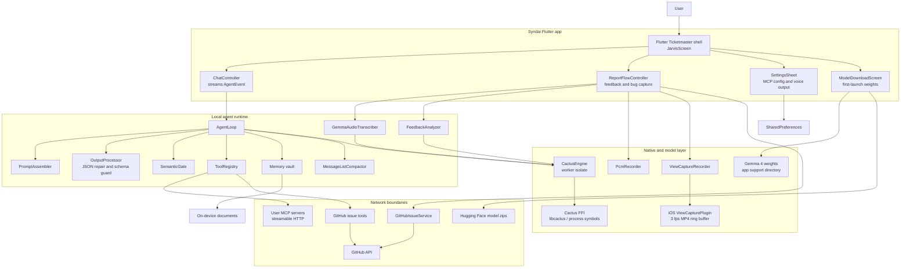
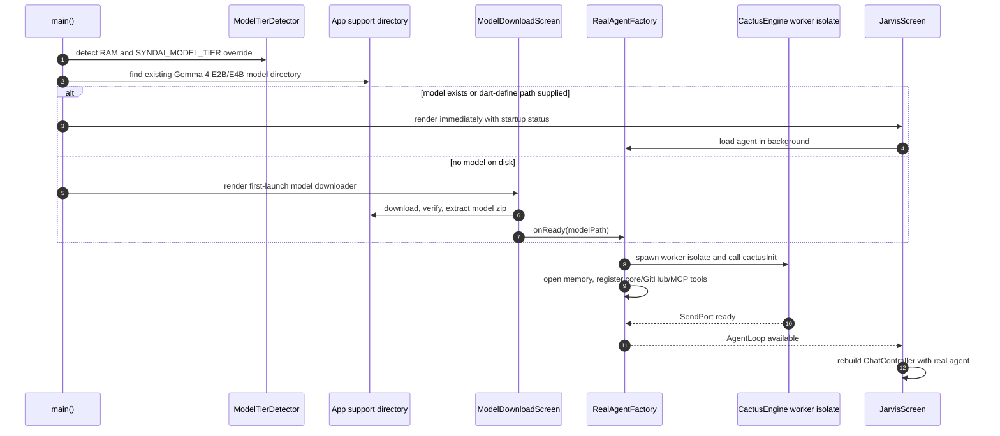
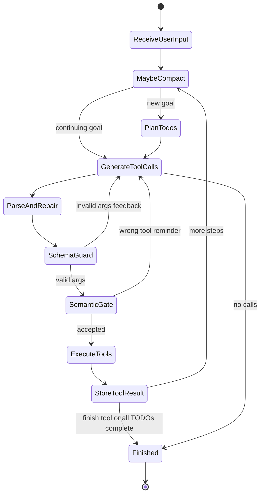
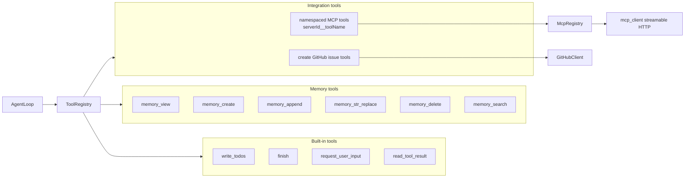
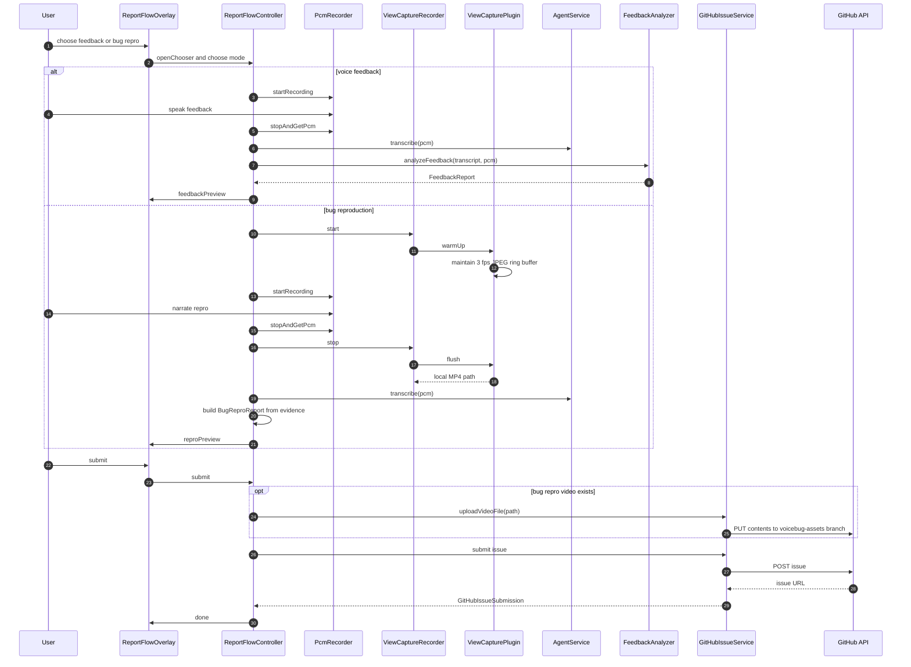
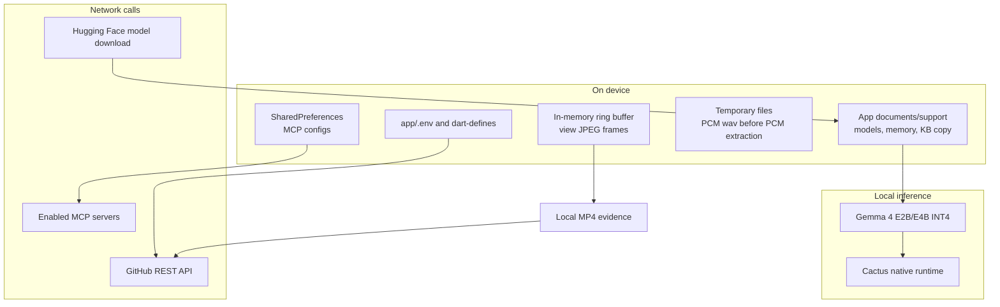

# Syndai

<!-- markdownlint-disable MD013 -->

Syndai is an on-device voice coworker embedded in a Ticketmaster-style mobile app.
It runs Gemma 4 through Cactus, captures spoken feedback or bug reproductions,
turns them into structured reports, and submits GitHub issues with the evidence an
engineering team needs.

This README documents the current default app path rooted at `app/lib/main.dart`.

## What It Does

- Runs a local Gemma 4 E2B or E4B INT4 model through the Cactus FFI runtime.
- Selects a model tier from device RAM, with compile-time overrides for testing.
- Records 16 kHz mono PCM voice input and transcribes it through the local model.
- Captures iOS app-view video evidence with a `drawHierarchy` ring buffer.
- Converts voice feedback into sentiment, themes, pain points, and support next steps.
- Converts narrated repro sessions into GitHub-ready bug reports.
- Registers local, GitHub, memory, and user-configured remote MCP tools behind
  one agent loop.
- Falls back to a mock agent when the real model or native runtime is unavailable.

## Architecture At A Glance



## Repository Layout

| Path | Purpose |
|---|---|
| `app/lib/main.dart` | App bootstrap, model-tier detection, first-launch model download, real/mock agent selection. |
| `app/lib/cactus/` | Dart FFI bindings, Cactus worker isolate, model tiering, model download/extract pipeline. |
| `app/lib/agent/` | Agent loop, prompt assembly, tool registry, TODO ledger, memory tools, compaction, JSON output guards. |
| `app/lib/mcp/` | User-configured MCP server persistence and runtime tool registration. |
| `app/lib/voice/` | PCM capture, Gemma audio transcription wrapper, local TTS output. |
| `app/lib/sdk/` | GitHub services, feedback analyzer, local KB, view capture abstraction, device metadata. |
| `app/lib/ui/` | Ticketmaster demo shell, Jarvis UI, report overlays, settings, model download UI. |
| `app/ios/Runner/ViewCapturePlugin.swift` | iOS `drawHierarchy` frame capture and MP4 encoder for repro evidence. |
| `app/assets/kb/` | Bundled support knowledge base used for feedback resolution. |
| `app/assets/memory_bootstrap/` | First-run memory vault seed files. |
| `app/test/` | Unit and widget coverage for agent loop, report flow, model tiering, GitHub, memory, output processing, and UI. |
| `app/DEMO.md` | Platform-specific runbook for Cactus, iOS, Android, and macOS demo setup. |

## Runtime Startup



Startup is deliberately non-blocking. `runApp` happens before `cactusInit`, so
the user sees the Ticketmaster shell while the several-GB model memory maps in a
background isolate. If model initialization fails, the provider tree binds
`MockAgentService` and surfaces a startup message instead of leaving a blank app.

## Core Components

### Flutter Shell

`SyndaiApp` owns startup state and provider wiring. It creates:

- `AppSettings` for voice output preferences.
- `McpServerStore` for persisted remote MCP servers.
- `TextToSpeechService` for spoken summaries.
- `ChatController` for ordered `AgentEvent` rendering.
- `JarvisScreen` for the Ticketmaster interaction surface and report entrypoint.

### Cactus Runtime

`CactusEngine` is the single high-level model gateway. It owns a long-lived
worker isolate because repeatedly creating isolates around the Cactus model
handle is unreliable and expensive.

Its public contracts are:

- `completeRaw` and `completeRawWithMetadata` for raw model responses.
- `completeText` for text extraction from Cactus response wrappers.
- `completeJson` for schema-shaped JSON with parse-and-retry.
- `completeToolCalls` for all tool calls emitted in a single model turn.
- `ragQuery` for optional Cactus RAG corpus lookups.

The worker isolate serializes all model calls, reports token counts to the main
isolate for progress UI, detects worker exits, and fails pending requests instead
of hanging callers.

### Agent Loop



`AgentLoop` keeps the model on a constrained execution rail:

- It plans with `write_todos` at the beginning of a new goal.
- It sends the model an AGENTS-style passive tool index plus full tool schemas.
- It executes every parsed function call in a multi-call turn.
- It repairs common Gemma tool-call drift through `OutputProcessor`.
- It validates arguments against each tool schema before execution.
- It blocks obviously mismatched tool choices with `SemanticGate`.
- It truncates large tool results into handles that can be re-fetched.
- It compacts long histories with `MessageListCompactor` once the serialized
  message list crosses the token threshold.

The default `maxSteps` is 10 because this codebase assumes the C FFI does not
currently expose Cactus tool constraints. Reliability is therefore enforced by
JSON repair, retries, schema validation, and loop guards.

### Tool System



Tool registration is centralized in `ToolRegistry`. Remote MCP tools are
namespaced with the configured server id to avoid collisions. Tool execution
returns structured maps, and exceptions are converted to tool-result errors so
the agent can continue reasoning about failures.

### Memory

The memory vault is a markdown tree under `<app documents>/memory/`.

- First run seeds `AGENT.md`, `INDEX.md`, `identity/user.md`, and
  `preferences/general.md` from bundled assets.
- `INDEX.md` is rewritten after creates and deletes.
- Paths are relative-only, slug-normalized, and checked for traversal.
- Writes are atomic through a temporary file and rename.
- Files are capped at 50 KB.
- Obvious secret patterns are rejected before writes.
- The prompt only injects the small bootstrap set; detailed memory is pulled
  through tools.

### Feedback And Bug Reporting



Feedback mode sends only structured text to GitHub. Bug mode may upload a local
MP4 recording to a dedicated `voicebug-assets` branch before creating the issue.
Raw standalone audio is not persisted by the report pipeline.

### View Capture

`ViewCaptureRecorder` is the Dart abstraction for screen evidence. On iOS it
talks to `ViewCapturePlugin` over the `syndai_view_capture` method channel:

- `warmUp` starts a 3 fps main-thread capture timer and primes the first frame.
- Captured frames are compressed JPEGs held in a 60 second ring buffer.
- `flush` encodes buffered frames into H.264 MP4 through `AVAssetWriter`.
- `coolDown` cancels capture and clears the buffer.

This captures the app view hierarchy directly.

## Data Flow And Ownership



Local-first behavior is the default. Network calls happen for model download,
enabled MCP tools, and GitHub issue or evidence submission.

## Configuration

| Variable | Where it is read | Purpose |
|---|---|---|
| `SYNDAI_MODEL_TIER=e2b\|e4b` | `--dart-define` | Overrides RAM-based model tier selection. |
| `SYNDAI_GEMMA4_E2B_PATH` | `--dart-define` | Developer-supplied E2B model directory. |
| `SYNDAI_GEMMA4_E4B_PATH` | `--dart-define` | Developer-supplied E4B model directory. |
| `SYNDAI_GEMMA4_PATH` | `--dart-define` | Legacy fallback model path. |
| `SYNDAI_ENABLE_CACTUS_RAG=true` | `--dart-define` | Copies bundled KB markdown into a Cactus RAG corpus before engine load. |
| `CACTUS_DYLIB_PATH` | process environment on macOS | Explicit native `libcactus.dylib` path. |
| `VOICEBUG_GH_OWNER` | `app/.env`, process env, or `--dart-define` | GitHub repository owner for issue submission. |
| `VOICEBUG_GH_REPO` | `app/.env`, process env, or `--dart-define` | GitHub repository name for issue submission. |
| `VOICEBUG_GH_TOKEN` | `app/.env`, process env, or `--dart-define` | GitHub token for issue and evidence upload. |

Do not commit real GitHub tokens. `app/.env` is ignored by git and is loaded at
startup for local development.

## Setup

### Flutter App

```bash
cd /Users/sidsharma/CactusHackathon/voice-agents-hack/app
flutter pub get
flutter test
flutter run -d macos
```

Without model paths or a native Cactus library, the app runs in mock mode. This
is useful for UI work and most widget tests.

### Real Local Model On macOS

Build Cactus and download weights outside this repository, then run the app with
compile-time model paths:

```bash
export CACTUS_DYLIB_PATH=/Users/sidsharma/CactusHackathon/cactus/cactus/build/libcactus.dylib
export SYNDAI_GEMMA4_E2B_PATH=/Users/sidsharma/CactusHackathon/cactus/weights/gemma-4-e2b-it
export SYNDAI_GEMMA4_E4B_PATH=/Users/sidsharma/CactusHackathon/cactus/weights/gemma-4-e4b-it

cd /Users/sidsharma/CactusHackathon/voice-agents-hack/app
flutter run -d macos \
  --dart-define=SYNDAI_GEMMA4_E2B_PATH=$SYNDAI_GEMMA4_E2B_PATH \
  --dart-define=SYNDAI_GEMMA4_E4B_PATH=$SYNDAI_GEMMA4_E4B_PATH
```

See `app/DEMO.md` for the full iOS simulator, iOS device, Android, and Cactus
build runbook.

### GitHub Issue Submission

Create `app/.env` locally:

```dotenv
VOICEBUG_GH_OWNER=your-org
VOICEBUG_GH_REPO=your-repo
VOICEBUG_GH_TOKEN=github_pat_or_ghp_token
```

The token needs permission to create issues. Bug repro video upload also writes
files to the `voicebug-assets` branch through the repository contents API.

## Model Tiering

| Device RAM | Tier | Model |
|---|---|---|
| 12 GB or more | `e4b` | `google/gemma-4-E4B-it` INT4 |
| 4 GB to 11 GB | `e2b` | `google/gemma-4-E2B-it` INT4 |
| Unknown | `e2b` | Safer fallback |

Tier detection uses `device_info_plus`:

- Android: physical RAM from `ActivityManager.MemoryInfo.totalMem`.
- iOS: physical RAM from `NSProcessInfo.processInfo.physicalMemory`.
- macOS: memory size from `sysctl hw.memsize`.

## Testing

Run the standard suite from `app/`:

```bash
flutter test
```

Useful focused suites:

```bash
flutter test test/agent_loop_test.dart
flutter test test/output_processor_test.dart
flutter test test/view_capture_recorder_test.dart
flutter test test/report_flow_controller_test.dart
flutter test test/view_capture_integration_test.dart
flutter test test/jarvis_screen_test.dart
```

Cactus-backed smoke/eval tests are tagged and require a real model path:

```bash
SYNDAI_GEMMA4_PATH=/path/to/gemma-4-e4b-it flutter test -t cactus
```

## Current Boundaries

- The app is local-first, but GitHub, MCP, and model download flows use the network.
- The Cactus C FFI is treated as the source of truth for local inference. The app
  adds Dart-side guardrails because constrained tool decoding is not available
  through the current FFI surface.
- The iOS repro recorder captures the app window view hierarchy. It is not a full
  device screen recorder.
- Android support depends on shipping the correct `libcactus.so` into
  `app/android/app/src/main/jniLibs/<abi>/`.

## External Docs

- [Cactus docs](https://docs.cactuscompute.com/latest/)
- [GitHub Markdown Mermaid diagrams](https://docs.github.com/en/enterprise-cloud@latest/get-started/writing-on-github/working-with-advanced-formatting/creating-diagrams)
- [Mermaid project](https://github.com/mermaid-js/mermaid)
